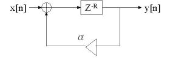
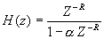
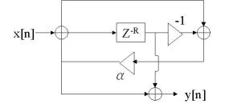
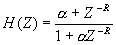
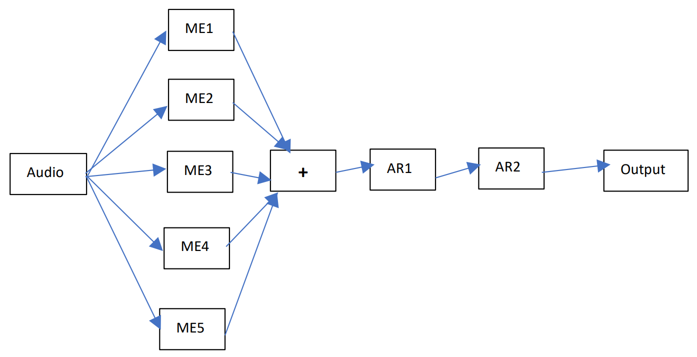

#### Natural Sounding Reverberator

- I made a natural sounding reverberator which are widely used in music industries. 
- The IIR filter design was chosen as the magnitude response contain many peaks. 
- Here, IIR design can have naturally occurring decay characteristics but may not contain original frequencies. 
- The natural sounding reverberator was simulated by combining 5 IIR Multi-Echo filters and 2 All pass Reverberator filters with suitable decay factors and delay units to get the corresponding output audio effect.

---

#### IIR Multi-Echo Filter (MEF)
- Echo: A repeated sound received late enough to be heard as distinct from the source.

 \

#### IIR All-Pass Reverberator Filter (APRF)
- REVERB (Reverberation): The effect which may be added to audio during recording or to a voice during performance that sustains the sound longer than normal, as if the sound was reverberating around a large building (e.g., cathedral).
- It is persistence of the sound after the source has ceased.

 \

---

#### Cascade 5 IIR MEF and 2 IIR APRF
- The cascading is show in the below flow diagram having 5 ME (Multi-Echo) and 2 AR (All-Pass Reverberator) filters with adjustable a and R based on requirement to generate a pleasant sounding reverberation. 

##### All the above filters are created using MATLAB programming wherein one can provide the audio file path and listen the soothing changes.